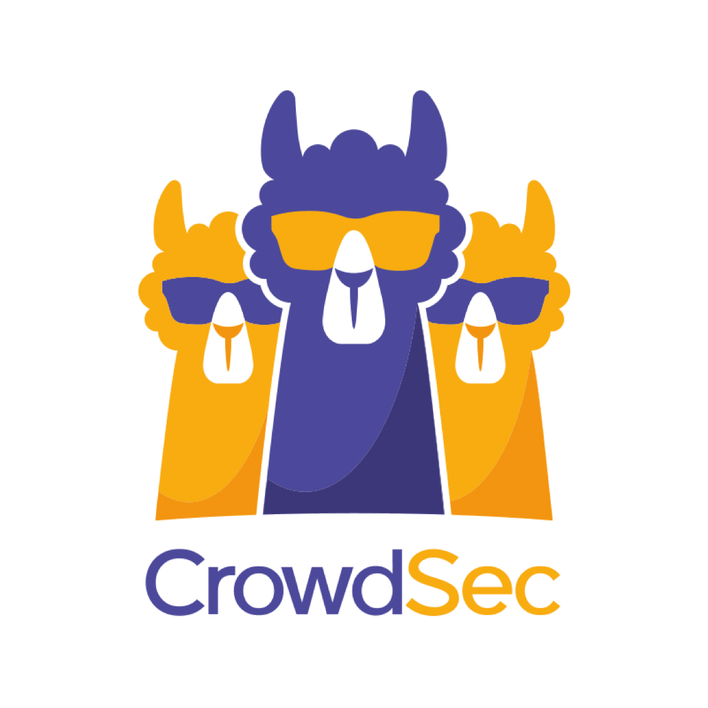

# About

<p align="center">

</p>

CrowdSec is a free, open-source and collaborative IPS. Analyze behaviors, respond to attack & share signals across the community.

* [Github](https://github.com/crowdsecurity/crowdsec)
* [Documentation](https://doc.crowdsec.net/docs/next/intro)
* [Docker Image](https://hub.docker.com/r/crowdsecurity/crowdsec)

Crowdsec can be use as an alternative to [fail2ban](../fail2ban) if you want it too, however in this example, we are going to use it as a web/traefik IPS. We will be configuring crowdsec to protect all of our web facing services from any suspect users. Fail2ban will still be useful to protect our host.


# Table of Contents

<!-- TOC -->

- [About](#about)
- [Table of Contents](#table-of-contents)
- [Files structure](#files-structure)
- [Information](#information)
    - [docker-compose](#docker-compose)
    - [Crowdsec](#crowdsec)
    - [Traefik bouncer](#traefik-bouncer)
- [Usage](#usage)
    - [Configuration](#configuration)
    - [Crowdsec](#crowdsec)
    - [Bouncer](#bouncer)
- [Update](#update)
- [Security](#security)
- [Backup](#backup)

<!-- /TOC -->

# Files structure 
```bash
.
├── crowdsec-config/
│   └── acquis.yaml
├── crowdsec-db/
├── docker-compose.yml
└── .env
```

- `crowdsec-config/acquis.yaml` - a file containing path to the logs that crowdsec is supposed to read
- `crowdsec-db` - a directory used to store crowdsec sqlite database
- `docker-compose.yml` - a docker-compose file, use to configure your application’s services

Please make sure that all the files and directories are present.


# Information

## docker-compose
Links to the following [docker-compose.yml](docker-compose.yml) and the corresponding [.env](.env).

* docker-compose.yml
  ```yaml
    version: '3'

    services:
        crowdsec:
            image: crowdsecurity/crowdsec:latest
            container_name: crowdsec
            restart: unless-stopped
            environment:
            - COLLECTIONS="crowdsecurity/traefik"
            - GID=${PGID}
            volumes:
            - ../traefik/log:/var/log/traefik
            - ./crowdsec-config/acquis.yaml:/etc/crowdsec/acquis.yaml
            - ./crowdsec-db:/var/lib/crowdsec/data
            networks:
            - proxy

        bouncer-traefik:
            image: fbonalair/traefik-crowdsec-bouncer:latest
            container_name: crowdsec-bouncer-traefik
            restart: unless-stopped
            depends_on:
            - crowdsec
            environment:
            - CROWDSEC_BOUNCER_API_KEY=${TRAEFIK_BOUNCER_KEY}
            - CROWDSEC_AGENT_HOS=crowdsec:8080
            networks:
            - proxy    

    networks:
        proxy:
            external: true
  ```
* .env
  ```ini
    TRAEFIK_BOUNCER_KEY=xxxxxx

    # user PGID - can be found by running id your-user
    PGID=1000
  ```

## Crowdsec

Crowdsec will be directly linked to traefik, in order for crowdsec to be able to analyze the requests going through traefik, we are mouting traefik logs into the crowdsec container. This log file must also be specified on traefik own [docker-compose](../traefik/docker-compose.yml), uncomment the corresponding line.

Crowdsec is composed of an agent that parse logs and creates alerts that local API or LAPI transform into decisions. If it detects any malicious behavior, it will add it to the ban list, which is also enriched by the crowdsec community.

The Crowdsec container is only focused on the detection, it will not take any action !

## Traefik bouncer 

Crowdsec being a detection component, remediation is implemented using bouncers. As we are using Traefik, we will be using a [traefik specific bouncer](https://hub.crowdsec.net/author/fbonalair/bouncers/traefik-crowdsec-bouncer).

For every request going through Traefik, the bouncer will block any malicious IP to access your services. For this it leverages Traefik v2 ForwardAuth middleware and query CrowdSec with client IP. If the client IP is on ban list, it will get a http code 403 response. Otherwise, request will continue as usual.

# Usage

## Configuration

The CrowdSec configuration in Traefik is ready to be use, to activate it, uncomment the crowdsec middleware in Traefik, it is located at [traefik/traefik.yml](../traefik/traefik.yml). 

As you will need to generate an API key for the bouncer, start with the crowdsec container only :
```bash
sudo docker-compose up -d crowdsec
```

Get a bouncer API key from CrowdSec :
```
sudo docker exec crowdsec cscli bouncers add traefik-bouncer
```

Paste this API key as the value for the bouncer environment variable CROWDSEC_BOUNCER_API_KEY in [.env](.env).

Start the bouncer by running :
```
sudo docker-compose up -d 
```

## Crowdsec

[cscli](https://doc.crowdsec.net/docs/next/cscli/cscli) is the main command to interact with your crowdsec service, scenarios & db. It is meant to allow you to manage bans, parsers/scenarios/etc, api and generally manage you crowdsec setup.

Display crowdsec metrics :

```bash
sudo docker-compose exec crowdsec cscli metrics
```

Check bouncer status :

```bash
sudo docker-compose exec crowdsec cscli bouncers list
```

Check alerts :

```bash
sudo docker-compose exec crowdsec cscli alerts list
```

Check decisions :

```bash
sudo docker-compose exec crowdsec cscli decisions list
```

## Bouncer

If you want to verify that the bouncer if working correctly, you can ban your own IP :

```bash
sudo docker-compose exec crowdsec cscli decisions add --ip 192.168.128.1
```

Unban yourself with :

```bash
sudo docker-compose exec crowdsec cscli decisions delete --ip 192.168.128.1
```

# Update

The image is automatically updated with [watchtower](../watchtower) thanks to the following label :

```yaml
  # Watchtower Update
  - "com.centurylinklabs.watchtower.enable=true"
```

# Security

Check [CrowdSec colletions hub](https://hub.crowdsec.net/browse/#collections) to enhanced your security with community scenarios.

# Backup

Docker volumes are globally backed up using [borg-backup](../borg-backup). 