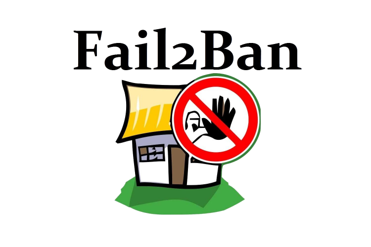

# About

<p align="center">

</p>

Fail2ban scans log files and bans IPs that show the malicious signs.

* [Github](https://github.com/fail2ban/fail2ban)
* [Documentation](http://www.fail2ban.org/wiki/index.php/Fail2Ban)
* [Docker Image](https://github.com/crazy-max/docker-fail2ban)

We are going to be using a prebuilt docker image by crazymax to facilitate the process.
There are a lot of fail2ban configurations availabe on the internet, and you can even create your own, this guide provides the following features :

- SSH jail configuration
- Vaultwarden jail configuration 

# Table of Contents

<!-- TOC -->

- [About](#about)
- [Table of Contents](#table-of-contents)
- [Files structure](#files-structure)
- [Information](#information)
    - [docker-compose](#docker-compose)
    - [jails](#jails)
- [Usage](#usage)
    - [Configuration](#configuration)
    - [Fail2ban](#fail2ban)
- [Update](#update)
- [Security](#security)
- [Backup](#backup)

<!-- /TOC -->

# Files structure 
```bash
.
|-- data/
|   |-- action.d/
|   |   |-- nftables-forward.conf
|   |   |-- nftables-input.conf
|   |-- db/
|   |-- filter.d/
|   |   |-- bitwarden-admin.conf
|   |   |-- bitwarden-auth.conf
|   `-- jail.d/
|       |-- bitwarden-admin.conf
|       |-- bitwarden-auth.conf
|       |-- sshd.conf
`-- docker-compose.yml
```

- `data/action.d` - a directory containing custom action configuration to execute when banning an IP
- `data/db` - a directory used to store fail2ban sqlite database
- `data/filter.d` - a directory containing custom filter configuration used by a jail to match malicious signs
- `data/jail.d` - a directory containing custom jail configuration for your services
- `docker-compose.yml` - a docker-compose file, use to configure your application’s services

Please make sure that all the files and directories are present.


# Information

## docker-compose
Links to the following [docker-compose.yml](docker-compose.yml) and the corresponding [.env](.env).

* docker-compose.yml
  ```yaml
  version: '3'

  services:
    fail2ban:
      image: crazymax/fail2ban:latest
      container_name: fail2ban
      restart: unless-stopped
      volumes:
        - /var/log:/var/log:ro
        - ./data:/data
      environment:
        - TZ=${TZ}
      network_mode: host
      cap_add:
      - NET_ADMIN
      - NET_RAW
      labels:
        # Watchtower Update
        - "com.centurylinklabs.watchtower.enable=true"
  ```
* .env
  ```ini
  TZ=Europe/Paris
  ```

We are gonna use `/var/log` directory to parse log files.

## jails

The jail.d directory is provided with three examples.

- sshd.conf : provides ssh protection, will ban any IP trying to bruteforce your ssh credentials, a must-have if you are still on port 22.

- bitwarden-auth.conf : provides your vaultwarden password manager from bruteforce. 

- bitwarden-admin.conf : provides your vaultwarden admin dashboard from bruteforce. 

You can find the vaultwarden filters in the filter.d directory. For example, in `filter.d/vaultwarden-auth` you can find :

```ini
[INCLUDES]
before = common.conf

[Definition]
failregex = ^.*Username or password is incorrect\. Try again\. IP: <HOST>\. Username:.*$
ignoreregex =
```

This filter is using regex and will match any log that fails to connect to your vaultwarden vault. The log file that is parsed is `/var/log/syslog`, redirection is provided with the docker-compose available in the [vaultwarden guide](../vaultwarden).

# Usage

## Configuration

Replace the environment variables in `.env` with your own, then run :

```bash
sudo docker-compose up -d
```

The jails and filters configured are going to be active, you can now create as many as you want to protect your services.

## Fail2ban

[Fail2ban commands](http://www.fail2ban.org/wiki/index.php/Commands) can be used through the container. 
Here is an example if you want to unban an IP manually:

```
sudo docker exec -t fail2ban fail2ban-client set <JAIL> unbanip <IP>
```

The same example with [bitwarden](../vaultwarden), in the case you failed to enter the right password 3 times:
```
sudo docker exec -t fail2ban fail2ban-client set bitwarden-auth unbanip <IP>
```

For a more general example, you can use any fail2ban command as follows:
```
sudo docker exec -t fail2ban fail2ban-client <COMMAND>
```

# Update

The image is automatically updated with [watchtower](../watchtower) thanks to the following label :

```yaml
  # Watchtower Update
  - "com.centurylinklabs.watchtower.enable=true"
```

# Security

Be careful not to get ban as the iptable action is pretty aggressive, you will not be able to SSH with the banned IP.

# Backup

Docker volumes are globally backed up using [borg-backup](../borg-backup). 