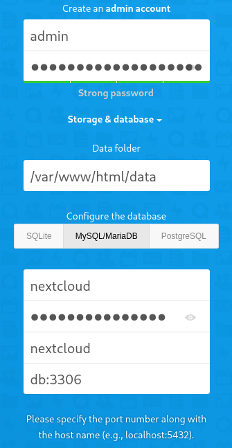

# About

<p align="center">

</p>

Nextcloud is a safe home for all your data. Access & share your files, calendars, contacts, mail & more from any device, on your terms.

* [Github](https://github.com/nextcloud/docker)
* [Documentation](https://docs.nextcloud.com/server/latest/admin_manual/contents.html)
* [Docker Image](https://hub.docker.com/_/nextcloud)

# Table of Contents

<!-- TOC -->

- [About](#about)
- [Table of Contents](#table-of-contents)
- [Files structure](#files-structure)
- [Information](#information)
    - [docker-compose](#docker-compose)
- [Usage](#usage)
    - [Requirements](#requirements)
    - [Configuration](#configuration)
- [Update](#update)
- [Security](#security)
- [Backup](#backup)

<!-- /TOC -->

# Files structure 

```bash
.
|-- .env
|-- docker-compose.yml
|-- nextcloud-mysql/
`-- shared/
```

- `.env` - a file containing all the environment variables used in the docker-compose.yml
- `docker-compose.yml` - a docker-compose file, use to configure your application’s services
- `nextcloud-mysql/` - a directory used to store the mysql data
- `shared/` - a directory used to store nextcloud's data

Please make sure that all the files and directories are present.

# Information

## docker-compose
Links to the following [docker-compose.yml](docker-compose.yml) and the corresponding [.env](.env).

* docker-compose.yml
  ```yaml
  version: '3'

  services:
    db:
      image: mariadb:10.5
      container_name: nextcloud-mysql
      restart: unless-stopped
      command: --transaction-isolation=READ-COMMITTED --binlog-format=ROW
      volumes:
        - ./nextcloud-mysql/db:/var/lib/mysql
      environment:
        - MYSQL_ROOT_PASSWORD=${DB_ROOT_PASSWD}  # Requested, set the root's password of MySQL service.
        - MYSQL_PASSWORD=${DB_PASSWD}
        - MYSQL_DATABASE=nextcloud
        - MYSQL_USER=nextcloud
        - MYSQL_LOG_CONSOLE=true
      networks:
        - nextcloud-net
      labels:
        # Watchtower Update
        - "com.centurylinklabs.watchtower.enable=true"

    nextcloud:
      image: nextcloud:latest
      container_name: nextcloud
      restart: unless-stopped
      volumes:
        - ./shared:/shared
      networks:
        - proxy
        - nextcloud-net
      depends_on:
        - db
      labels:
        - "traefik.enable=true"
        - "traefik.http.routers.nextcloud.rule=Host(`${TRAEFIK_NEXTCLOUD}`)"
        - "traefik.http.routers.nextcloud.entrypoints=https"
        - "traefik.http.routers.nextcloud.tls=true"
        - "traefik.http.routers.nextcloud.tls.certresolver=mydnschallenge"
        # Watchtower Update
        - "com.centurylinklabs.watchtower.enable=true"
        # Ip filtering
        - "traefik.http.routers.nextcloud.middlewares=whitelist@file"

  networks:
    nextcloud-net:
    proxy:
      external: true
  ```
* .env
  ```ini
  TRAEFIK_NEXTCLOUD=nextcloud.example.com
  DB_ROOT_PASSWD=xxxxxxxxxxxxxxx
  DB_PASSWD=xxxxxxxxxxxxxxx
  ```


# Usage

## Requirements
- [Traefik up and running](../traefik).
- A subdomain of your choice, this example uses `nextcloud`.
    - You should be able to create a subdomain with your DNS provider, use a `A record` with the same IP address as your root domain.

## Configuration

Replace the environment variables in `.env` with your own, then run :

```bash
sudo docker-compose up -d
```

You should now be able to access the nextcloud admin account creation. 
Nextcloud will ask you to create your admin account as well as to choose what type of database your want to use. In the docker-compose we set up a mariadb database, choose it and enter the following database credentials.

<p align="center">

</p>

The password is the one you have modified in the `.env` file : DB_PASSWD.
Nextcloud will now finish installing and will soon be ready to use.


# Update

The image is automatically updated with [watchtower](../watchtower) thanks to the following label :

```yaml
      # Watchtower Update
      - "com.centurylinklabs.watchtower.enable=true"
```

# Security

Nextcloud provides client-side end-to-end data encryption. You can create encrypted libraries to use this feature. Use this feature to add extra security to your documents.

# Backup

Docker volumes are globally backed up using [borg-backup](../borg-backup). 