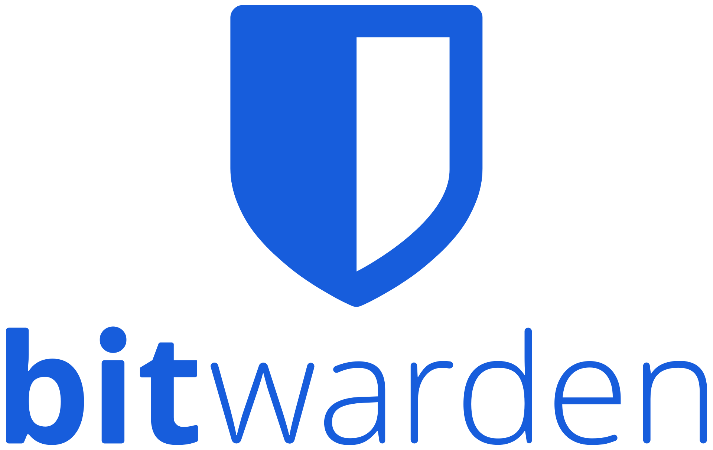

# About

<p align="center">

</p>

Vaultwarden is an alternative implementation of the Bitwarden server API written in Rust and compatible with upstream Bitwarden clients, it is perfect for self-hosted deployment where running the official resource-heavy service might not be ideal.

* [Github](https://github.com/dani-garcia/vaultwarden)
* [Documentation](https://github.com/dani-garcia/vaultwarden/wiki)
* [Docker Image](https://hub.docker.com/r/vaultwarden/server)

Bitwarden is a free and open-source password management service that stores sensitive information such as website credentials in an encrypted vault.

# Table of Contents

<!-- TOC -->

- [About](#about)
- [Table of Contents](#table-of-contents)
- [File structure](#file-structure)
- [Information](#information)
    - [docker-compose](#docker-compose)
- [Usage](#usage)
    - [Requirements](#requirements)
    - [Configuration](#configuration)
- [Update](#update)
- [Security](#security)
- [Backup](#backup)

<!-- /TOC -->

# File structure 

```
.
|-- .env
|-- data/
`-- docker-compose.yml
```

- `.env` - a file containing all the environment variables used in the docker-compose.yml
- `docker-compose.yml` - a docker-compose file, use to configure your application’s services
- `data/` - a directory used to store vaultwarden data

Please make sure that all the files and directories are present.

# Information

## docker-compose
Links to the following [docker-compose.yml](docker-compose.yml) and the corresponding [.env](.env).

```
version: "3"

services:
  bitwardenrs:
    image: bitwardenrs/server
    container_name: bitwardenrs
    restart: unless-stopped
    volumes:
      - ./data:/data
    environment:
      - WEBSOCKET_ENABLED=true
      - WEB_VAULT_ENABLED=true
      - SIGNUPS_ALLOWED=false
      # Comment admin token to disable admin interface
      - ADMIN_TOKEN=${ADMIN_TOKEN}
    networks:
      - proxy
    labels:
      - "traefik.enable=true"
      - "traefik.http.routers.bitwarden.rule=Host(`vaultwarden.example.com`)"
      - "traefik.http.routers.bitwarden.entrypoints=https"
      - "traefik.http.routers.bitwarden.tls=true"
      - "traefik.http.routers.bitwarden.tls.certresolver=mydnschallenge"
      # Watchtower Update
      - "com.centurylinklabs.watchtower.enable=true"
      # Ip filtering
      - "traefik.http.routers.bitwarden.middlewares=whitelist@file"
    logging:
      driver: "syslog"
      options:
        tag: "Bitwarden"

networks:
  proxy:
    external: true
```

# Usage

## Requirements
- [Traefik up and running](../traefik).
- A subdomain of your choice, this example uses `vaultwarden`.
    - You should be able to create a subdomain with your DNS provider, use a `A record` with the same IP address as your root domain.

## Configuration

Replace the environment variable in `.env` with your own, then run :

```
sudo docker-compose up -d
```

You should then be able to access the bitwarden web-ui admin interface with the ADMIN_TOKEN. 

# Update

The image is automatically updated with [watchtower](../watchtower) thanks to the following label :

```
      # Watchtower Update
      - "com.centurylinklabs.watchtower.enable=true"
```

# Security

Comment admin token to disable the admin interface after you have created your users.

# Backup

Docker volumes are globally backed up using [borg-backup](../borg-backup). 