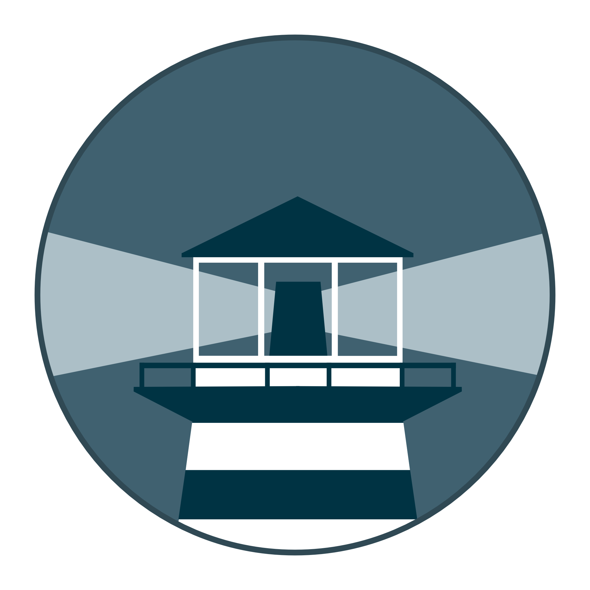

# About

<p align="center">

</p>

Watchtower is a container-based solution for automating Docker container base image updates. It will pull down your new image, gracefully shut down your existing container and restart it with the same options that were used when it was deployed initially.

* [Github](https://github.com/containrrr/watchtower)
* [Documentation](https://containrrr.dev/watchtower/)
* [Docker Image](https://hub.docker.com/r/containrrr/watchtower)

# Table of Contents

<!-- TOC -->

- [About](#about)
- [Table of Contents](#table-of-contents)
- [Files structure](#files-structure)
- [Information](#information)
    - [docker-compose](#docker-compose)
- [Usage](#usage)
    - [Configuration](#configuration)
- [Update](#update)
- [Security](#security)
- [Backup](#backup)

<!-- /TOC -->

# Files structure 

```bash
.
|-- .env
`-- docker-compose.yml
```

- `.env` - a file containing all the environment variables used in the docker-compose.yml
- `docker-compose.yml` - a docker-compose file, use to configure your application’s services

Please make sure that all the files and directories are present.

# Information

The following docker-compose is configured to check for update every monday. If you are using the borg-backup [strategy](../borg-backup), everything will be backed-up before the image is updated to prevent data corruption. 

Watchtower if configured to automatically upgrade your images and to then, send you a notification with [gotify](../gotify). Everything can be changed by modifying the [environnement variables](https://containrrr.dev/watchtower/arguments/).

If you want watchtower to only notify you and not upgrade the images, uncomment the following environnement variable in the docker-compose : `- WATCHTOWER_MONITOR_ONLY=true`

## docker-compose
Links to the following [docker-compose.yml](docker-compose.yml) and the corresponding [.env](.env).

* docker-compose.yml
  ```yaml
  version: "3"

  services:
    watchtower:
      image: containrrr/watchtower
      container_name: watchtower
      restart: unless-stopped
      volumes:
        - /var/run/docker.sock:/var/run/docker.sock
      environment:
        - WATCHTOWER_CLEANUP=true
        - WATCHTOWER_LABEL_ENABLE=true
        #- WATCHTOWER_MONITOR_ONLY=true
        #- WATCHTOWER_POLL_INTERVAL=30
        - WATCHTOWER_SCHEDULE=0 0 4 * * MON
        - WATCHTOWER_NOTIFICATIONS=gotify
        - WATCHTOWER_NOTIFICATION_GOTIFY_URL=${GOTIFY_URL}
        - WATCHTOWER_NOTIFICATION_GOTIFY_TOKEN=${GOTIFY_TOKEN}
      labels:
        - "com.centurylinklabs.watchtower.enable=true"
  ```
* .env
  ```ini
  # The gotify token can be configured in the gotify WebUI
  GOTIFY_URL=https://gotify.example.com/
  GOTIFY_TOKEN=xxxxxxxxxxxxxxxxxx
  ```

# Usage

## Configuration

If you don't want to use gotify for the notification, feel free to remove the environnement variables from both the `.env` and the `docker-compose.yml` file.

Replace the environment variables in `.env` with your own, then run :

```bash
sudo docker-compose up -d
```

Watchtower will then check for update every monday and send you a notification with gotify once an image is updated.

# Update

The image is automatically updated with [watchtower](../watchtower) thanks to the following label :

```yaml
  # Watchtower Update
  - "com.centurylinklabs.watchtower.enable=true"
```

# Security

Automatically upgrading open-source images can be a huge security risk. The safest solution would be to only [monitor](https://containrrr.dev/watchtower/arguments/#without_updating_containers) the images and check the updated image before doing the upgrade.

# Backup

Backup are not required.