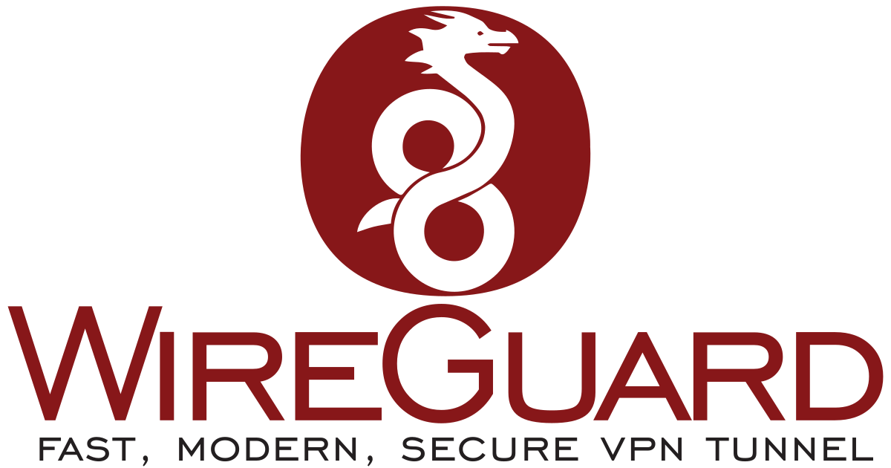

# About

<p align="center">

&nbsp;&nbsp;&nbsp;&nbsp;&nbsp;&nbsp;&nbsp;&nbsp;&nbsp;&nbsp;&nbsp;&nbsp;&nbsp;&nbsp;&nbsp;&nbsp;&nbsp;&nbsp;

&nbsp;&nbsp;&nbsp;&nbsp;&nbsp;&nbsp;&nbsp;&nbsp;&nbsp;&nbsp;&nbsp;&nbsp;&nbsp;&nbsp;&nbsp;&nbsp;&nbsp;&nbsp;

</p>

Wireguard is a virtual private network (VPN), it provides you a secure, encrypted tunnel for online traffic and allow you to manage a remote private network.
Pihole is a DNS sinkhole that protects your devices from unwanted content without installing any client-side software. Unbound is a validating, recursive, caching DNS resolver. 

* Wireguard
  * [Github](https://github.com/WireGuard)
  * [Documentation](https://www.wireguard.com/quickstart/)
  * [Docker Image](https://hub.docker.com/r/linuxserver/wireguard)

* Pi-Hole
  * [Github](https://github.com/pi-hole/pi-hole)
  * [Documentation](https://docs.pi-hole.net/)
  * [Docker Image](https://hub.docker.com/r/pihole/pihole)

* Unbound
  * [Github](https://github.com/NLnetLabs/unbound)
  * [Documentation](https://unbound.docs.nlnetlabs.nl/en/latest/)
  * [Docker Image](https://hub.docker.com/r/mvance/unbound)

This guide combine the three services so that every device that are connected to the VPN also pass through pihole and unbound. Having a VPN will also reinforce security for your overall infrastructure as you can combine it with [traefik IP whitelist](../traefik#Configuration).

Credits to [@IAmStoxe](https://github.com/IAmStoxe/wirehole).

# Table of Contents

<!-- TOC -->

- [About](#about)
- [Table of Contents](#table-of-contents)
- [Files structure](#files-structure)
- [Information](#information)
    - [docker-compose](#docker-compose)
- [Usage](#usage)
    - [Requirements](#requirements)
    - [Configuration](#configuration)
        - [Wireguard](#wireguard)
        - [Pihole](#pihole)
- [Update](#update)
- [Security](#security)
- [Backup](#backup)

<!-- /TOC -->

# Files structure

```bash
.
|-- docker-compose.yml
|-- etc-dnsmasq.d/
|-- etc-pihole/
|-- unbound/
`-- wireguard/
```

* `docker-compose.yml` - a docker-compose file, use to configure your application’s services
* `etc-dnsmasq.d/` - a directory used to store dnsmasq configs
* `etc-pihole/` - a directory used to store your Pi-hole configs
* `wireguard/` - a directory used to store wireguard data, including client ready-to-use configuration files
* `unbound/` - a directory used to store unbound data

Please make sure that all the files and directories are present.

# Information

## docker-compose

Links to the following [docker-compose.yml](docker-compose.yml) and the corresponding [.env](.env).

* docker-compose.yml
  ```yaml
  version: "3"

  services:
    unbound:
      image: mvance/unbound:latest
      container_name: unbound
      restart: unless-stopped
      hostname: unbound
      volumes:
        - ./unbound:/opt/unbound/etc/unbound/
      networks:
        private_network:
          ipv4_address: 10.2.0.200
      labels:
        # Watchtower Update
        - "com.centurylinklabs.watchtower.enable=true"


    wireguard:
      depends_on: [unbound, pihole]
      image: linuxserver/wireguard
      container_name: wireguard
      restart: unless-stopped
      cap_add:
        - NET_ADMIN
        - SYS_MODULE
      environment:
        - PUID=${PUID}
        - PGID=${PGID}
        - TZ=${TZ}
        - SERVERPORT=51820
        - SERVERURL=${SERVERURL} #optional
        - PEERS=${PEERS} # How many peers to generate for you (clients)
        - PEERDNS=10.2.0.100 # Set it to point to pihole
        - INTERNAL_SUBNET=10.6.0.0
      volumes:
        - ./wireguard:/config
        - /lib/modules:/lib/modules
      ports:
        - "51820:51820/udp"
      dns:
        - 10.2.0.100 # Points to pihole
        - 10.2.0.200 # Points to unbound
      sysctls:
        - net.ipv4.conf.all.src_valid_mark=1
      networks:
        private_network:
          ipv4_address: 10.2.0.3
      labels:
        # Watchtower Update
        - "com.centurylinklabs.watchtower.enable=true"

    pihole:
      depends_on: [unbound]
      container_name: pihole
      image: pihole/pihole:latest
      restart: unless-stopped
      hostname: pihole
      dns:
        - 127.0.0.1
        - 10.2.0.200 # Points to unbound
      environment:
        TZ: "Europe/Paris"
        WEBPASSWORD: "" # Blank password - Can be whatever you want.
        ServerIP: 10.1.0.100 # Internal IP of pihole
        DNS1: 10.2.0.200 # Unbound IP
        DNS2: 10.2.0.200 # If we don't specify two, it will auto pick google.
      # Volumes store your data between container upgrades
      volumes:
        - "./etc-pihole/:/etc/pihole/"
        - "./etc-dnsmasq.d/:/etc/dnsmasq.d/"
      # Recommended but not required (DHCP needs NET_ADMIN)
      #   https://github.com/pi-hole/docker-pi-hole#note-on-capabilities
      cap_add:
        - NET_ADMIN
      networks:
        private_network:
          ipv4_address: 10.2.0.100
      labels:
        # Watchtower Update
        - "com.centurylinklabs.watchtower.enable=true"

  networks:
    private_network:
      ipam:
        driver: default
        config:
          - subnet: 10.2.0.0/24
  ```
* .env
  ```ini
  SERVERURL=vpn.example.com

  # How many peers to generate for you (clients)
  PEERS=2

  # user PUID and group PGID - can be found by running id your-user
  PUID=1000
  PGID=1000
  ```

# Usage

## Requirements

* A subdomain of your choice for your VPN, this example uses `vpn`.
  * You should be able to create a subdomain with your DNS provider, use a `A record` with the same IP address as your root domain.
* Ports 51820 open, check your firewall.

## Configuration

The linuxserver images are using the PUID and PGID, they allow the container to map the container's internal user to a user on the host machine, more information [here](https://docs.linuxserver.io/general/understanding-puid-and-pgid).

To find yours, use `id user`. Replace the environment variables in `.env` with your own, then run :

```bash
sudo docker-compose up -d
```

### Wireguard

* Getting the client configuration file

You should be able to find the required configuration for your clients in the `wireguard` directory. Each client will have an associated folder called `peerX`.
Inside this folder you can find a QR code for your smartphone as well as configuration file for your linux/windows.

* Adding more clients

If you want more clients, just change the value in the `.env` file and relaunch the service `sudo docker-compose up -d`.


### Pihole

Once connected to the VPN you should be able to access the pihole admin interface at http://10.2.0.100/admin, for more information regarding pihole you can check the well written official pihole [documentation](https://docs.pi-hole.net/).

# Update

The images are automatically updated with [watchtower](../watchtower) thanks to the following label :

```yaml
  # Watchtower Update
  - "com.centurylinklabs.watchtower.enable=true"
```

# Security

A VPN is often a good solution to always have a dedicated IP. If you want to secure your others services, you can limit their access only when you are connected to your VPN. An easy way to do that is to add the private IP address range used by docker (172.16.0.0/12), your internal IP through the VPN will be one of this range, to the traefik [whitelist](traefik/rules/whitelist.yml).

Keep in mind that only the containers that have the following label attached will be prone to this IP restriction.

```yaml
  # Ip filtering
  - "traefik.http.routers.service-router-name.middlewares=whitelist@file"
```

# Backup

Docker volumes are globally backed up using [borg-backup](../borg-backup).
